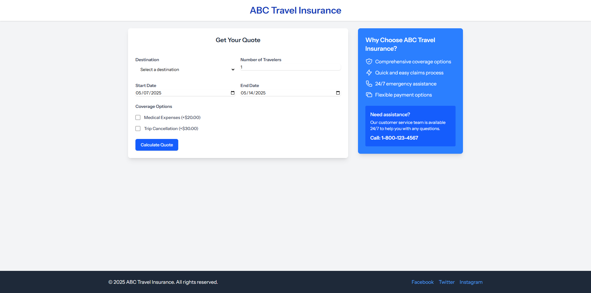
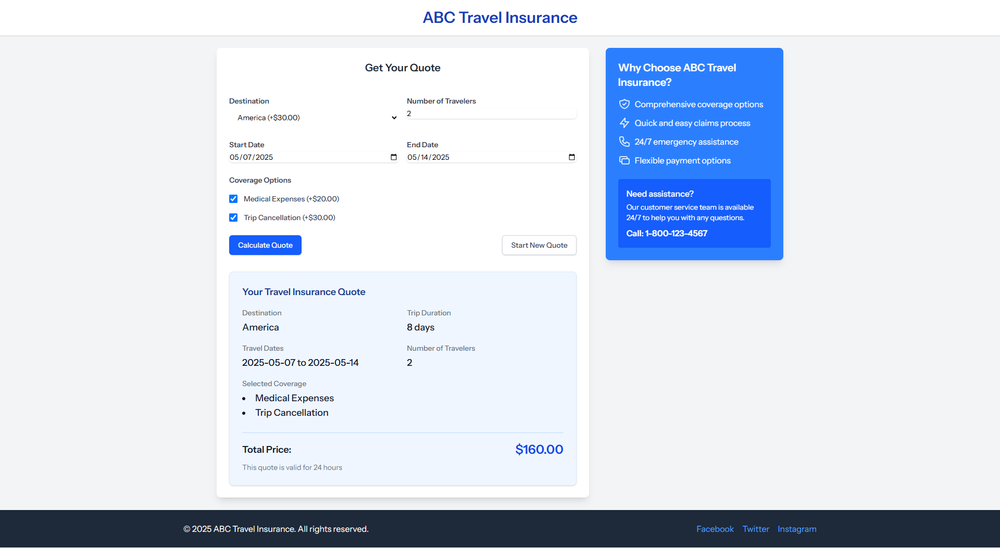

# Travel Insurance Quoting System -Technical Documentation

## 1. Project Overview
This Laravel application provides a travel insurance quoting system that allows users to calculate insurance costs based on their destination, trip duration, number of travelers, and selected coverage options.

## 2. System Architecture

### 2.1 High-Level Architecture

```
├── Controller
├── Livewire
├── DTO
├── Service Layer
├    ├── Pricing 
├           ├── Contracts 
├── Repository Layer
├    ├── Contracts
├── Domain Layer (Models)
└── Database Layer
└── Views
     ├── componets  
     ├── layouts  
     ├── livewire  
     ├── pages  
```
### 2.2 Design Patterns Implemented

- **MVC Pattern**: Base Laravel architecture for separation of concerns
- **Strategy Pattern**: Used for pricing calculations based on different destinations
- **Factory Pattern**: Used to instantiate the appropriate pricing strategy
- **Repository Pattern**: For data access abstraction
- **DTO (Data Transfer Objects)**: For clean data handling between layers
- **Service Layer**: Encapsulates business logic

### 2.3 SOLID Principles Application

- **Single Responsibility**: Each class has a clear, focused purpose (repositories handle data, strategies handle pricing, etc.)
- **Open/Closed**: The pricing strategy system is open for extension but closed for modification
- **Liskov Substitution**: All pricing strategies can be used interchangeably
- **Interface Segregation**: Interfaces are focused and minimal
- **Dependency Injection**: High-level modules depend on abstractions, not implementations

### 2.4 KISS/DRY Principles Application
- Avoid code duplication and maintain a straightforward implementation

### 2.5 Pricing Strategy
- Interface and abstract base class for destination-specific pricing
- Concrete implementations for each destination type
- Factory for creating appropriate strategy instances

### 2.6 Frontend
- Responsive Tailwind CSS design
- Livewire components for dynamic interaction
- Form validation on both client and server side

## 3. Implementation Plan

### 3.1 Database Design

**destinations table:**
- id (primary key)
- name (string, unique)
- code (string)
- base_price (decimal)
- created_at (timestamp)
- updated_at (timestamp)

**coverage_options table:**
- id (primary key)
- name (string, unique)
- code (string)
- price (decimal)
- created_at (timestamp)
- updated_at (timestamp)

**quotes table:**
- id (primary key)
- destination_id (foreign key)
- start_date (date)
- end_date (date)
- number_of_travelers (int)
- total_price (decimal)
- client_ip (ip)
- user_agent (string)
- created_at (timestamp)
- updated_at (timestamp)
- indexes - destination_id

**coverage_option_quote table:**
- id (primary key)
- coverage_option_id (foreign key)
- quote_id (foreign key)
- created_at (timestamp)
- updated_at (timestamp)

### 3.2 Testing Strategy

- **Feature Tests**: For Livewire components.
- **Unit Tests**: For Service classes and Repository.

## 4. Deliverables

### 4.1 Scalability & Performance

- Caching for pricing calculations and to frequently accessing data
- Database indexing for frequently queried fields
- Query optimization

### 4.2 Security Considerations

- CSRF protection for all forms
- Input validation and sanitization
- Rate limiting for public endpoints
- No raw SQL queries (uses Eloquent ORM)

## 4.3 Code Quality and Best Practices

- Add static typing (Used **`Larastan`** for type checking).
- Detailed PHPDoc comments
- Maintaining clean code style (Used **`Laravel pint`**)
- Meaningful variable and method naming
- No business logic in controllers (thin controllers, fat models/services).
- Specific error handling and validation.

## 5. Future Scalability
The architecture allows for easy extensions such as:

- Adding more destinations or coverage options
- Implementing more complex pricing rules
- Adding authentication and user accounts
- Expanding to include more insurance products
- Internationalizing the application

## 6. App Screens




## 7. Project setup instructions

### 7.1 Prerequisites

- PHP 8.2 or higher
- Composer
- MySQL or PostgreSQL
- Apache or nginx

### 7.2 Installation Steps

- Clone the project using `git clone` command
````
git clone https://github.com/kalidusachintha/insurance_quote_app.git
cd insurance_quote_app
````
- Rename `.env.example `to`.env`
- Configure your database in the `.env` file
- Run `php artisan migrate --seed`

### 7.3 Issues and troubleshooting

- For database connection errors, verify your database credentials and check if the database exists
- If migrations fail, check if your database user has sufficient privileges

### 7.4 Additional Commands

- Run tests: `php artisan test`
- Clear cache: `php artisan cache:clear`
- Clear config: `php artisan config:clear`
